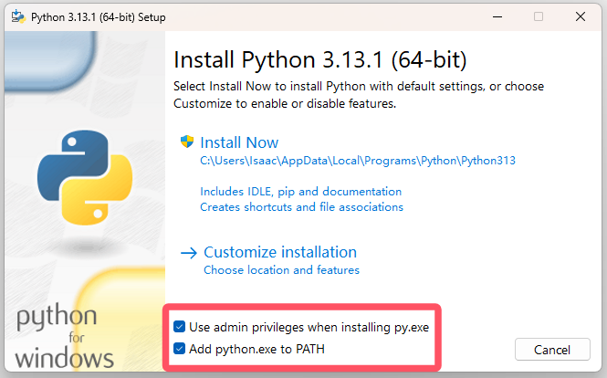

目前仅有“通过命令行安装”一篇教程。

## 使用命令行安装

:::: steps

1. 安装 Python
   
   如果您还没有安装 Python ，[前往 Python 官网下载并安装](https://www.python.org/downloads/)

   > NcatBot 是完全依赖 Python 运行的喵~

   安装时最好勾选上下图红框中两项。
   
   

   安装完成后在您的终端中输入`python --version`来验证安装和系统环境变量是否正确，如果返回版本号并且没有报错就是安装成功了。

   > 如果显示找不到 Python 可以重启电脑试试哦~

2. 启动 NcatBot
   
   NcatBot 是基于 NapCatQQ 的，而 NapCatQQ 是基于 QQ NT 的！这意味着您必须在您的设备上安装 QQ 和 NapCatQQ 并启用他们，然后您才能够正常使用 NcatBot SDK 。

   请点击[这个链接](https://napneko.pages.dev/guide/start-install)跳转到 NapCatQQ 文档并获取适用于不同平台的 NapCatQQ 的安装方法。

   > 请先完成链接中整个“快速开始”栏目再回来喵~

   ::: tip
   QQ NT 支持在 Windows 、 MacOS 以及 Linux 上运行， NapCatQQ 提供了在这三种平台运行的方法，而 NcatBot 是 Python SDK ，也就是说您能在您所接触到的任何主流桌面操作系统上运行您的 Bot 。
   :::

   偷偷告诉你：如果运行`launcher.bat`没反应的话可以试着运行`launcher-user.bat`试试哦

   启动后可在启动日志中看到形如`[WebUi] WebUi Local Panel Url: http://127.0.0.1:6099/webui?token=xxxx`的 token 信息。

   也可打开`./config/webui.json`文件，在其中找到 token ,下面是文件示例：

   ```json:no-line-numbers
   {
    "host": "0.0.0.0", // WebUI 监听地址
    "port": 6099, // WebUI 端口
    "prefix": "", // WebUI 工作前缀，此项功能将在进阶配置中解释
    "token": "xxxx", //登录密钥，默认是自动生成的随机登录密码
    "loginRate": 3, //每分钟登录次数限制
    }
    ```

    打开网页备用。

    > 给你的机器人发一条消息，看看控制台里会显示什么吧~

3. 欢迎回来！我们接下来获取 NcatBot ！
   
   使用 git clone 获取最新库：

    ::: code-tabs

    @tab GitHub

    ```bash:no-line-numbers
    git clone https://github.com/liyihao1110/NcatBot.git
    ```

    @tab Gitee
    ```bash:no-line-numbers
    git clone https://gitee.com/li-yihao0328/NcatBot.git
    ```
    :::

    也可以前往这个下载链接下载最新代码压缩包：[GitHub](https://codeload.github.com/liyihao1110/NcatBot/zip/refs/heads/main)

    下载后解压并将取出的文件放在您认为安全的地方。

    打开 main.py 所在的文件夹，在终端中输入

    ```bash:no-line-numbers
    pip install -r requirements.txt
    ```

以安装依赖库。

    ::: warning

    通常 GitHub 仓库会及时更新而 Gitee 仓库不保证为最新，因此我们推荐您下载 GitHub 版本的源码。后续会推出稳定的 Release 供下载。
    
    :::

4. 配置端口
   还记得我们刚刚打开的 webui 网页吗？现在找到它，点击左侧“网络配置”，点击右上角“添加配置”，分别添加如下两条配置：
   
   ::: demo-wrapper title="http配置"
   
   ```:no-line-numbers
   名称：ncatbothttp（可自选）
   类型：http服务端（httpServers）
   启用
   端口: 3000
   主机：127.0.0.1
   //其余保持不变，点击确认
   
   ```
   
   :::
   
   ::: demo-wrapper title="websocket配置"
   
   ```:no-line-numbers
   名称：ncatbotws（可自选）
   类型：WebSocket服务端（websocketServers）
   启用
   主机：0.0.0.0
   端口：3001
   //其余保持不变，点击确认
   ```

   :::

   操作完成后您应该能看到 NapCatQQ 的控制台有配置更改的提示。

5. 启动 NcatBot
   导航到 NcatBot-main ，即 main.py 所在的文件夹，在此处打开您的终端，执行：
   
   ```bash:no-line-numbers
   python main.py
   ```

   一切顺利的话，您应该能看到两个控制台显示
   
   ::: tabs
   @tab:active NcatBot
   [ncatpy] WebSocket 连接成功
   
   [ncatpy] 机器人 ********** 已启动!
   @tab NapCatQQ
   [OneBot] [WebSocket Server] Server Started :::3001
   :::
   
   恭喜您，属于您的 QQ 机器人已经配置完毕了！在群聊里发送一句“你好”，看看机器人会怎么回应吧！

::::